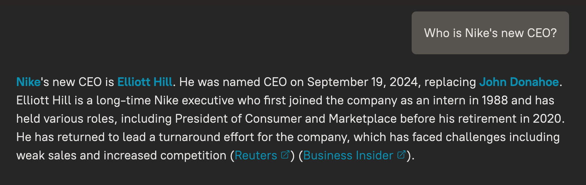

# Diffbot LLM

Diffbot LLM is an API that combines the reasoning ability of frontier large language models with the knowledge 
found in Diffbot's Knowledge Graph and realtime web index using Retrieval Augmented Generation. 

Diffbot LLM is best suited for applications that require maximum accuracy and 
factual grounding with authoritative citations.

Diffbot LLM API is fully compatible with OpenAI's Chat Completion API and can be used as a drop-in replacement.

## Diffbot LLM Inference Server

Diffbot LLM is available as a service hosted by Diffbot, or it can be self-hosted with the following open-source models:
 * diffbot-small (8b llama 3.1 fine tune): https://huggingface.co/diffbot/diffbot-small-1.0
 * diffbot-small-xl (70b llama 3.1 fine tune): https://huggingface.co/diffbot/diffbot-small-xl-1.0

This repo contains the Diffbot LLM Inference, a system to serve the open-source Diffbot LLM models
with built-in tool calling for Diffbot's Knowledge Graph and realtime web index.

This system requires an Nvidia GPU with at least 80G VRAM.

## Demo

A demo of Diffbot LLM is available at https://diffy.chat



## Usage

### API

#### Who is the CEO of Nike?

```python
from openai import OpenAI
# get your free token at https://app.diffbot.com/get-started/
diffbot_token = "<YOUR_TOKEN>"
base_url = "http://<YOUR_SERVER>:8001/rag/v1" # or https:/llm.diffbot.com/rag/v1 for Diffbot-hosted
client = OpenAI(api_key=diffbot_token, base_url=base_url)
completion = client.chat.completions.create(
    model="diffbot-small",
    temperature=0,
    messages=[
        {"role": "system", "content": "You are a helpful assistant."},
        {
            "role": "user",
            "content": "Who is Nike's CEO?"
        }
    ]
)
print (completion)
```

## Evaluation

### MMLU-Pro


### FreshQA


FreshQA  is a dynamic question answering benchmark encompassing a diverse range of question and answer types, including questions that 
require fast-changing world knowledge as well as questions with false premises that need to be debunked.

In this evaluation, we focus on 130 FreshQA questions whose answer have changed in 2024, which is after the knowledge
cutoff for all evaluated models as of December 2024.

## Pricing

Get a free token at: https://app.diffbot.com/get-started/

Contact sales@diffbot.com if need more credits or higher limits.

## Self-Hosting

### Using Docker image and models in huggingface 
1. Pull docker image: `docker pull docker.io/diffbot/diffbot-llm-inference:latest`
2. Run docker image. **Note: The model weights will be automatically downloaded from huggingface. 
This might take a few minutes.**

```bash
docker run --runtime nvidia --gpus all -p 8001:8001 --ipc=host -e VLLM_OPTIONS="--model diffbot/diffbot-small-1.0 --served-model-name diffbot-small --enable-prefix-caching"  docker.io/diffbot/diffbot-llm-inference:latest 
```

## Extending Diffbot LLM Inference Server

To extend the Diffbot LLM Inference Server with new tools, please refer to [this tutorial](add_tool_to_diffbot_llm_inference.md).

## Diffbot-Hosted Service

To test the Diffbot LLM Inference Server before self-hosting, set the base_url to `https:/llm.diffbot.com/rag/v1`

```python
from openai import OpenAI
# get your free token at https://app.diffbot.com/get-started/
diffbot_token = "<YOUR_TOKEN>"
base_url = "https:/llm.diffbot.com/rag/v1"
client = OpenAI(api_key=diffbot_token, base_url=base_url)
```